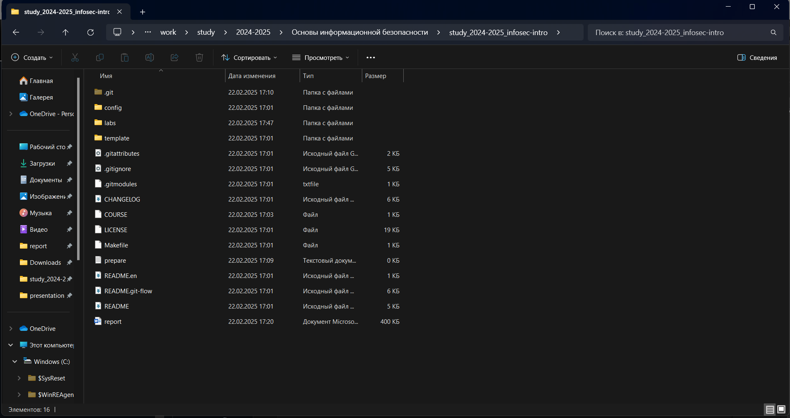
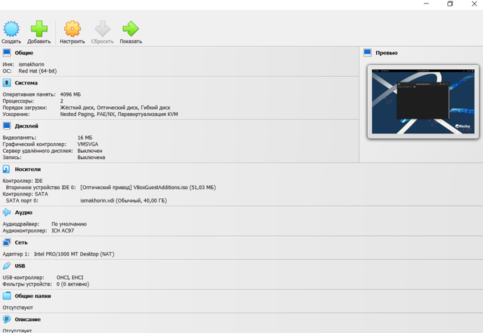
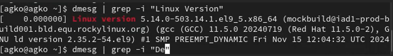
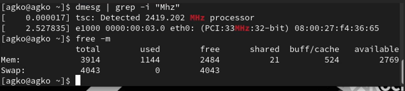
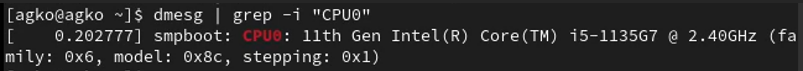
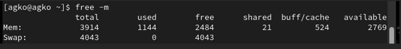
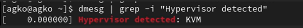
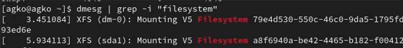
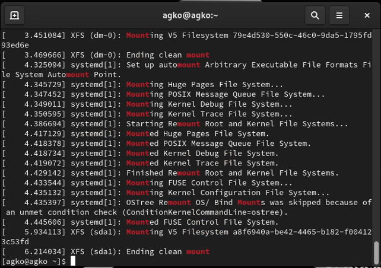

---
## Front matter
lang: ru-RU
title: Лабораторная работа №1
subtitle: Установка и конфигурация операционной системы на виртуальную машину
author:
  - Ко А.Г.
institute:
  - Российский университет дружбы народов, Москва, Россия
date: 18 февраля 2025

## i18n babel
babel-lang: russian
babel-otherlangs: english

## Formatting pdf
toc: false
toc-title: Содержание
slide_level: 2
aspectratio: 169
section-titles: true
theme: metropolis
header-includes:
 - \metroset{progressbar=frametitle,sectionpage=progressbar,numbering=fraction}
---

# Информация

## Докладчик

:::::::::::::: {.columns align=center}
::: {.column width="70%"}

  * Ко Антон Геннадьевич
  * Студент
  * Российский университет дружбы народов
  * [1132221551@pfur.ru](mailto:1132221551@pfur.ru)
  * <https://github.com/SenDerMen04>

:::
::::::::::::::

# Цель работы

Настроить рабочее пространство для лабораторных работ, приобрести практические навыки
установки операционной системы на виртуальную машину и настройки минимально необходимых для дальнейшей работы сервисов.
Изучить идеологию и применение средств контроля версий, освоить умения по работе с git.
Научиться оформлять отчёты с помощью легковесного языка разметки Markdown.

# Теоретическое введение

**Oracle VM VirtualBox** — это мощная и бесплатная виртуализационная платформа, разработанная корпорацией Oracle, которая позволяет пользователям создавать и управлять виртуальными машинами на своих компьютерах. [1]

**Системы контроля версий (Version Control System, VCS)** применяются при работе нескольких человек над одним проектом. Обычно основное дерево проекта хранится в локальном
или удалённом репозитории, к которому настроен доступ для участников проекта. При
внесении изменений в содержание проекта система контроля версий позволяет их
фиксировать, совмещать изменения, произведённые разными участниками проекта,
производить откат к любой более ранней версии проекта, если это требуется. [2]

В классических системах контроля версий используется централизованная модель,
предполагающая наличие единого репозитория для хранения файлов. Выполнение большинства функций по управлению версиями осуществляется специальным сервером.
Участник проекта (пользователь) перед началом работы посредством определённых
команд получает нужную ему версию файлов. После внесения изменений, пользователь
размещает новую версию в хранилище. При этом предыдущие версии не удаляются
из центрального хранилища и к ним можно вернуться в любой момент. Сервер может
сохранять не полную версию изменённых файлов, а производить так называемую дельта-компрессию — сохранять только изменения между последовательными версиями, что
позволяет уменьшить объём хранимых данных.

Системы контроля версий поддерживают возможность отслеживания и разрешения
конфликтов, которые могут возникнуть при работе нескольких человек над одним
файлом. Можно объединить (слить) изменения, сделанные разными участниками (автоматически или вручную), вручную выбрать нужную версию, отменить изменения вовсе
или заблокировать файлы для изменения. В зависимости от настроек блокировка не
позволяет другим пользователям получить рабочую копию или препятствует изменению
рабочей копии файла средствами файловой системы ОС, обеспечивая таким образом,
привилегированный доступ только одному пользователю, работающему с файлом.

Системы контроля версий также могут обеспечивать дополнительные, более гибкие
функциональные возможности. Например, они могут поддерживать работу с несколькими версиями одного файла, сохраняя общую историю изменений до точки ветвления
версий и собственные истории изменений каждой ветви. Кроме того, обычно доступна
информация о том, кто из участников, когда и какие изменения вносил. Обычно такого
рода информация хранится в журнале изменений, доступ к которому можно ограничить.

В отличие от классических, в распределённых системах контроля версий центральный
репозиторий не является обязательным.

Среди классических VCS наиболее известны CVS, Subversion, а среди распределённых — Git, Bazaar, Mercurial. Принципы их работы схожи, отличаются они в основном
синтаксисом используемых в работе команд.

Примеры команд для Git:

| Название команды | Описание команды                                                                                                         |
|--------------|----------------------------------------------------------------------------------------------------------------------------|
| `git clone`          | Клонирование репозитория на ПК                                                                              |
| `git commit -m "Initial Commit"`      | Оставление коммита    |
| `git push`       | Загрузка изменений на гит                       |
| `make`      | Конвертация файла .md |

**Markdown** - это легковесный язык разметки, который широко используется для создания форматированного текста в веб-среде. Его простота и читаемость делают его популярным среди разработчиков, писателей и блогеров. Синтаксис Markdown состоит из простых символов и правил форматирования, которые позволяют создавать заголовки, списки, ссылки, изображения и другие элементы веб-страниц без необходимости использовать сложные HTML-теги. Он также легко читается в исходном виде и может быть конвертирован в различные форматы, такие как HTML, PDF или документы Microsoft Word, делая Markdown удобным инструментом для создания содержательного и красочного контента в интернете. [3]
 

# Выполнение лабораторной работы

## Настройка рабочего пространства

{ #fig:001 width=100% height=100% }

## Установка и конфигурация операционной системы на виртуальную машину

{ #fig:002 width=100% height=100% }

{ #fig:003 width=100% height=100% }

## Домашнее задание

{ #fig:004 width=100% height=100% }

{ #fig:005 width=100% height=100% }

{ #fig:006 width=100% height=100% }

{ #fig:007 width=100% height=100% }

{ #fig:008 width=100% height=100% }

{ #fig:009 width=100% height=100% }

{ #fig:010 width=100% height=100% }

# Вывод

Было настроено рабочее пространство для лабораторных работ, приобретены практические навыки
установки операционной системы на виртуальную машину и настройки минимально необходимых для дальнейшей работы сервисов.
Были изучены идеология и применение средств контроля версий, освоены умения по работе с git.
Были приобретены практические навыки оформляения отчётов с помощью легковесного языка разметки Markdown.

# Список литературы. Библиография

[1] Документация по Virtual Box: https://www.virtualbox.org/wiki/Documentation

[2] Документация по Git: https://git-scm.com/book/ru/v2

[3] Документация по Markdown: https://learn.microsoft.com/ru-ru/contribute/markdown-reference

---

## Ответы на контрольные вопросы  

### 1. Что содержит информация об учетной записи пользователя?  
- Идентификатор учетной записи пользователя и ее имя  
- Идентификатор основной группы пользователя и ее название  

### 2. Основные команды Linux  
- **Справка по команде:**  
  info "название команды"  
  "название команды" --help  
- **Перемещение по файловой системе:**  
  cd "путь"  
- **Просмотр содержимого каталога:**  
  ls или dir  
- **Определение объема каталога:**  
  du -sh "путь"  
- **Создание каталога:**  
  mkdir "название"  
- **Удаление каталога:**  
  rmdir "название"  
- **Создание файла:**  
  touch "название"  
  cat > "название"  
- **Удаление файла:**  
  rm "название"  
- **Изменение прав доступа:**  
  chmod "права" "файл"  
- **Просмотр истории команд:**  
  history  

### 3. Файловые системы  

| Название | Максимальный размер файла | Максимальное число файлов | Максимальный размер тома |
|----------|---------------------------|---------------------------|--------------------------|
| NTFS     | 2⁶⁴ байт                   | 2³² - 1                   | 256 ТБ                   |
| EXT4     | 2⁴⁴ байт                   | 2³² - 1                   | 1048576 ТБ                |

### 4. Команда для проверки файловой системы  
dmesg | grep "filesystem"  

### 5. Команда для завершения процесса  
pkill "название процесса"  

---

## Вывод  

В ходе выполнения лабораторной работы были приобретены практические навыки установки операционной системы на виртуальную машину и настройки минимально необходимых для дальнейшей работы сервисов.
