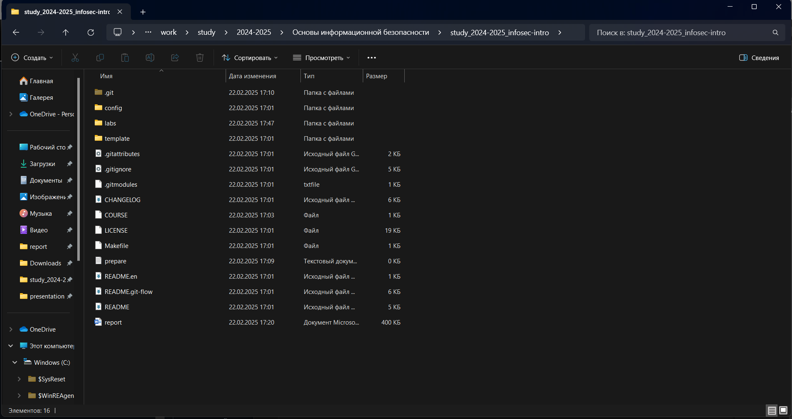

---
## Front matter
lang: ru-RU
title: 2 этап индивидуального проекта
subtitle: Информационная безопасность
author:
  - Махорин И. С.
institute:
  - Российский университет дружбы народов имени Патриса Лумумбы, Москва, Россия
date: 2024

## i18n babel
babel-lang: russian
babel-otherlangs: english

## Formatting pdf
toc: false
toc-title: Содержание
slide_level: 2
aspectratio: 169
section-titles: true
theme: metropolis
header-includes:
 - \metroset{progressbar=frametitle,sectionpage=progressbar,numbering=fraction}
 - '\makeatletter'
 - '\beamer@ignorenonframefalse'
 - '\makeatother'
---

## Докладчик

:::::::::::::: {.columns align=center}
::: {.column width="70%"}

  * Махорин Иван Сергеевич
  * Студент группы НПИбд-02-21
  * Студ. билет 1032211221
  * Российский университет дружбы народов имени Патриса Лумумбы

:::
::: {.column width="30%"}

:::
::::::::::::::

## Цель 2 этапа

- Установить DVWA в гостевую систему к Kali Linux.

# Ход выполнения индивидуального проекта

## Поиск инструкции по установке

Подробная инструкция по установке была найдена на RuTube (ссылка: https://rutube.ru/video/b5edbd9fa4dcbc71accbdadca638f228/)

## Проверка результата

{ #fig:001 width=80% height=80% }

# Вывод

## Вывод

- В ходе выполнения индивидуального проекта были приобретены практические навыки установки DVWA
  в гостевую систему к Kali Linux.

# Список литературы. Библиография

[[1] Документация по этапам индивидульного проекта:  Парасрам Шива, Замм Алекс, Хериянто Теди, Али Шакил, Буду Дамиан,
Йохансен Джерард, Аллен Ли П18 Kali Linux. Тестирование на проникновение и безопасность. — СПб.: Питер, 2020. — 448 с.:
ил. — (Серия «Для профессионалов»). ISBN 978-5-4461-1252-4